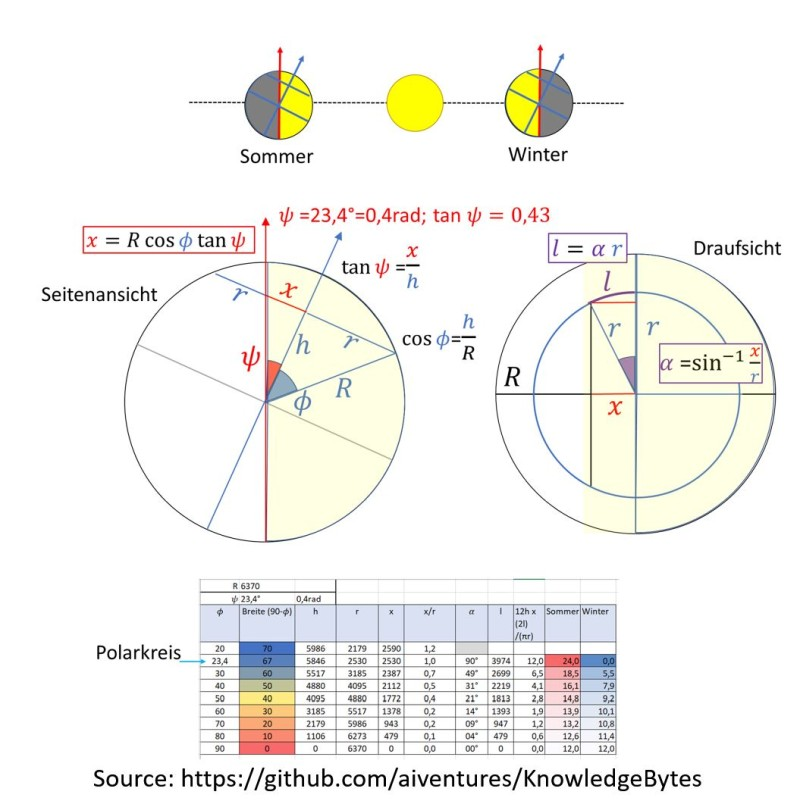

# KnowledgeBytes
Just some Knowledge Bits and Pieces\
- [Dec 24 2021 Solstice Duration](#Dec242021SolsticeDuration)
- dsds\

License: [Creative Commons: Attribution-NonCommercial 3.0 Unported (CC BY-NC 3.0)](https://creativecommons.org/licenses/by-nc/3.0/de/)

# Dec 24 2021 Solstice Duration
Always wondered how to calculate Duration for Solstice times. Tuzrns out it can be done by just putting together longitude calculation in conjunction with earth tilt angle:[20211224_Tageslänge.jpg](./images/20211224_Tageslänge.jpg=800x)\

